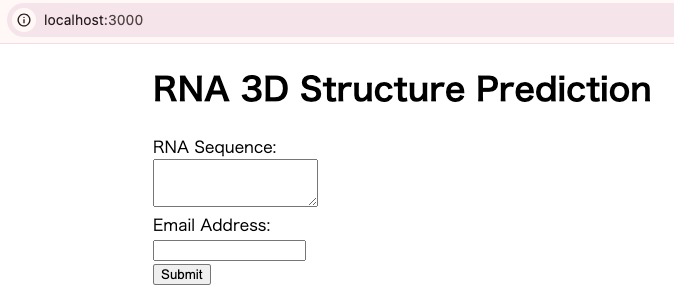

# rna_3d_prediction
A Single Page Application (SPA) using AWS that predicts the 3D structure of RNA sequences and returns the result via email.

## Architecture Overview
- GPU nodes used for inference are managed with Kubernetes and support auto-scaling, which helps reduce GPU usage costs.
- All Kubernetes resources are managed using Helm.
- Results are returned to users via AWS Lambda triggered email.
- Infrastructure is managed using Terraform (IaC), and GitHub Actions is used for Continuous Deployment (CD).
- The frontend is built with React.

## Usage Instructions

### 1. Backend Environment Setup
Terraform, Kubernetes, and other backend components are containerized and run via Docker:
```bash
# Start Docker containers
$ cd ./aws_env/docker
$ docker compose up -d

# Link your AWS account
$ docker compose exec -e COLUMNS=$COLUMNS aws bash
$ aws configure
```
If you're using GitHub Actions for continuous deployment (CD), you also need to configure the following repository secrets in your GitHub repository settings:  
- AWS_ACCESS_KEY_ID
- AWS_SECRET_ACCESS_KEY
- AWS_REGION  

These secrets are required to authenticate with AWS services from within your GitHub Actions workflow.

### 2. Backend Setup
Set the following environment variables to configure your deployment. Replace the example values with your own settings:
```bash
# S3 bucket settings for backend
$ BACKEND_BUCKET=my-terraform-backend-bucket-name     # for Terraform backend
$ BUCKET_NAME=rna-3d-predictions                      # for storing RNA prediction results

# Domain name used for your application or API (e.g., for ingress or Route53)
$ DOMAIN=example.com
```
Now, set up the backend infrastructure using the following steps:
```bash
# Deploy AWS infrastructure with Terraform
$ cd ./aws_env/terraform
$ source terraform_setup.sh

# Set up EKS cluster
$ cd ./aws_env/kubernetes
$ source ./src/eks_setup.sh

# Deploy Kubernetes resources
$ source ./src/kubernetes_setup.sh
```
You can test the backend using:
```bash
$ curl -X POST http://$DOMAIN/submit-job/ \
  -H "Content-Type: application/json" \
  -d '{
  "sequence": "AUGCUUAGCUGA",
  "email": "user@example.com"  # Replace with your actual email for testing
  }'
```

### 3. Frontend Setup
After running the following commands, access the app via http://localhost:3000:
```bash
# Set up the frontend environment
$ cd ./rna-fronted
$ docker compose up -d
```
Enter your RNA sequence and email address, then click Submit to start the prediction.
  


## Citation

This project makes use of [**Protenix**](https://doi.org/10.1101/2025.01.08.631967), an open-source reproduction of AlphaFold3.  
If you use this project in your research, please also consider citing the Protenix paper:

> **Chen, Xinshi**, **Zhang, Yuxuan**, **Lu, Chan**, **Ma, Wenzhi**, **Guan, Jiaqi**,  
> **Gong, Chengyue**, **Yang, Jincai**, **Zhang, Hanyu**, **Zhang, Ke**, **Wu, Shenghao**,  
> **Zhou, Kuangqi**, **Yang, Yanping**, **Liu, Zhenyu**, **Wang, Lan**, **Shi, Bo**,  
> **Shi, Shaochen**, and **Xiao, Wenzhi**.  
> _Protenix - Advancing Structure Prediction Through a Comprehensive AlphaFold3 Reproduction_.  
> bioRxiv, 2025. [https://doi.org/10.1101/2025.01.08.631967](https://doi.org/10.1101/2025.01.08.631967)

#### BibTeX

```bibtex
@article{chen2025protenix,
  title={Protenix - Advancing Structure Prediction Through a Comprehensive AlphaFold3 Reproduction},
  author={Chen, Xinshi and Zhang, Yuxuan and Lu, Chan and Ma, Wenzhi and Guan, Jiaqi and Gong, Chengyue and Yang, Jincai and Zhang, Hanyu and Zhang, Ke and Wu, Shenghao and Zhou, Kuangqi and Yang, Yanping and Liu, Zhenyu and Wang, Lan and Shi, Bo and Shi, Shaochen and Xiao, Wenzhi},
  year={2025},
  doi = {10.1101/2025.01.08.631967},
  journal = {bioRxiv}
}